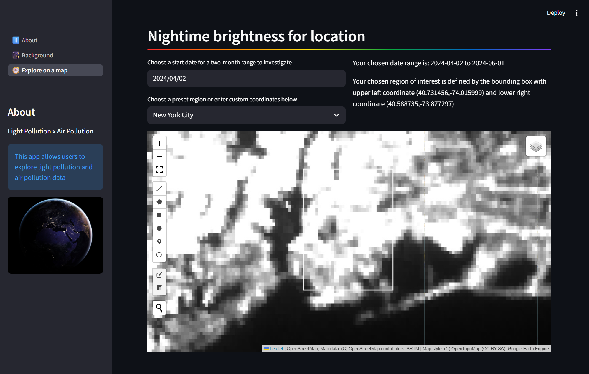
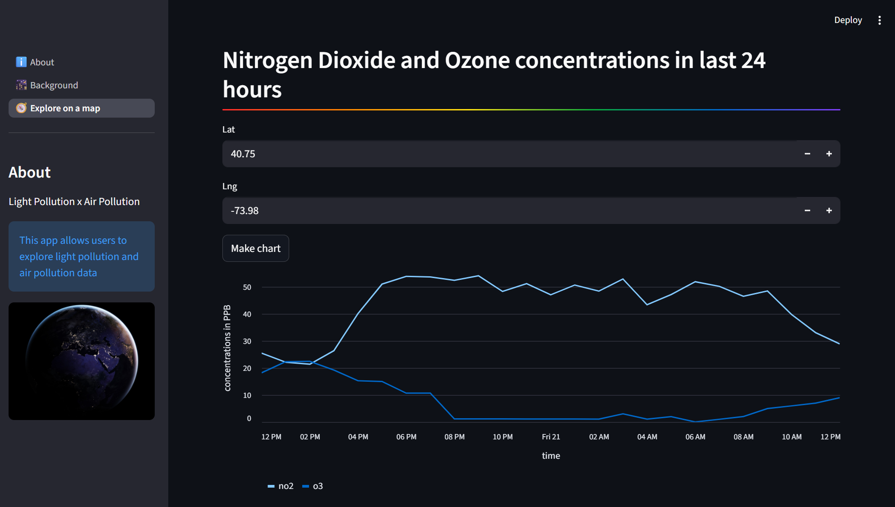

# Light Pollution x Air Quality Eplorer

final project for the fall 2025 cohort of the Terra.do Software x Climate course

## project details

✨ voted "most inspiring" project of the cohort ✨

### authors
- Misha Craddock
- Kelsi Flatland
- Nico Leffel
- Rhona Nyakulama

### links
- check out our [deployed Streamlit app](https://lightpollutionxclimate.streamlit.app/)
    - feel free to wake the app up if it is inactive :)
    - note: explorer page is temporarily down on this instance
- watch the [app demo video](https://www.youtube.com/watch?v=WGrpPfKZtoY) 

### technologies
- Python (v3.12.12 or higher)
- Streamlit
- APIs: Google Earth Engine, Google Air Quality API
- Jupyter notebooks

### app snapshots
- interactive light pollution map demo:


- air quality data demo:


## local setup

1. create (and enter) python virtual environment:
    ```
    python3 -m venv venv
    ```
    - to enter virtual env: `source venv/bin/activate`  
    - to leave virtual env: `deactivate`  

1. inside your virtual environment, install dependencies:
    ```
    python3 -m pip install -r requirements.txt
    ```

1. create `.streamlit/secrets.toml` to store environment variables

    - add your Google Air Quality API token as `GOOGLE_AQ_TOKEN`

1. to run the streamlit app:
    ```
    python3 -m streamlit run explorer_app.py
    ```
    
1. to run the jupyter notebook:
    ```
    jupyter notebook
    ```
